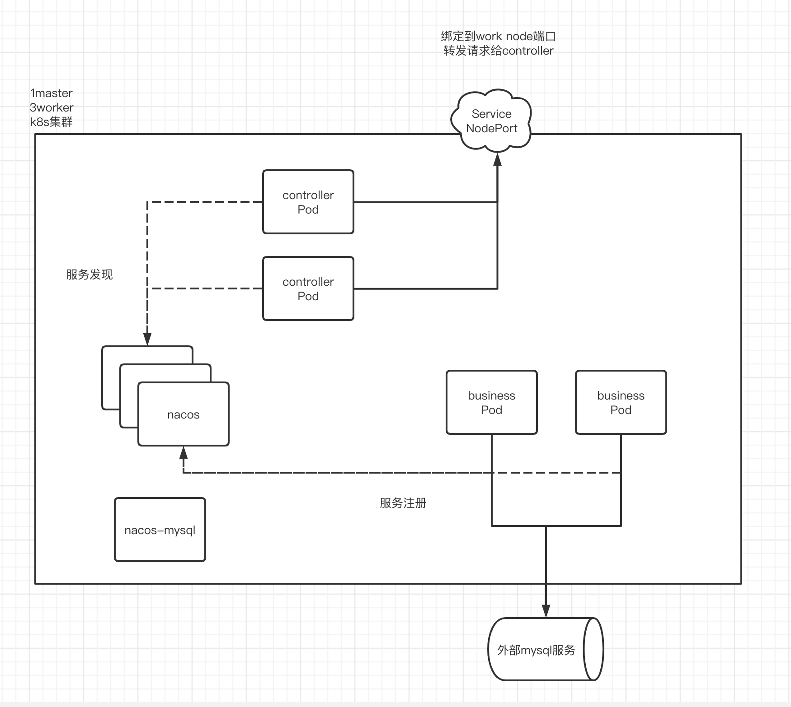
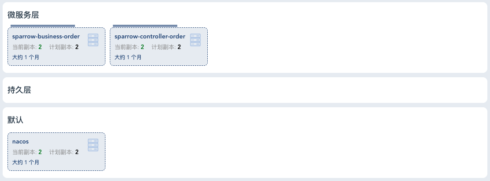
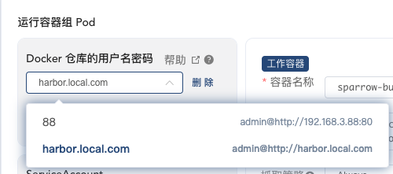

# 架构说明

## 微服务项目简介

### 选型

- Nacos注册中心
- Dubbo 微服务内部RPC

### 业务逻辑

本次实验的目的是走通实验k8s环境部署微服务的流程，业务内容使用最简单的订单新增

创建3个maven项目

- sparrow-controller：控制层提供http服务
  
  - sparrow-controller-order
- sparrow-business：业务层 提供dubbo服务供控制层调用
  
  - sparrow-business-order
- sparrow-repository：数据访问层 实现数据访问
  
  - sparrow-repository-order
  
    连接k8s集群外部另一台虚拟机上的mysql

依赖关系

- sparrow-business依赖sparrow-repository

  sparrow-repository中通过Mybatis实现对数据库的操作，打包到sparrow-business项目中

  > sparrow是一个SpringBoot项目，也可以单独模块部署，对业务层提供dubbo服务
  >
  > 单独部署需要修改业务层项目的pom依赖，剔除jdbc的相关依赖，并且业务层也要作为dubbo客户端调用数据访问层的服务

- sparrow-controller依赖sparrow-business和sparrow-repository

  本例中，控制层依赖sparrow-business的dubbo服务接口`IOrderService`；sparrow-business传导依赖了sparrow-repository中的领域模型`Order`作为DTO

  pom中需要注意，剔除sparrow-business-order中数据访问的相关依赖，spring的依赖注入机制会自动不加载相关的组件

  > MybatisPlusAutoConfiguration中的`@ConditionalOnClass({SqlSessionFactory.class, SqlSessionFactoryBean.class})`

  ```xml
  <dependency>
  	<groupId>org.ly817</groupId>
    <artifactId>sparrow-business-order</artifactId>
    <version>${project.version}</version>
    <exclusions>
      <!--排除来自sparrow-business-order中的jdbc设置 这里不需要加载数据库-->
      <exclusion>
        <groupId>com.zaxxer</groupId>
        <artifactId>HikariCP</artifactId>
      </exclusion>
      <!--阻止依赖的repository中加载mapper-->
      <exclusion>
        <groupId>org.mybatis</groupId>
        <artifactId>mybatis-spring</artifactId>
      </exclusion>
    </exclusions>
  </dependency>
  ```

> sparrow寓意这个项目麻雀虽小五脏俱全的意思

## 整体部署概述



- 三节点peer-to-peer模式的Nacos集群
  - Headless Service 不使用k8s自带的负载均衡
  - 固定的域名 给其他微服务作为服务注册中心地址
- 2实例 业务层订单服务
  - Headless Service
  - 微服务之间使用PodIp `10.244.x.x`进行通信
- 2实例 控制层订单服务
  - 创建NodePort类型的Service 供外部访问测试

# 部署Nacos注册中心

## 部署

官方提供的脚本`https://github.com/nacos-group/nacos-k8s.git`

使用quick-start.sh

- `kubectl create -f ./deploy/mysql/mysql-local.yaml` 创建数据持久化使用的mysql 
- `kubectl create -f ./deploy/nacos/nacos-quick-start.yaml` 创建nacos server StatefulSet

### mysql-local

创建一个mysql实例作为nacos的持久化存储

```yaml
apiVersion: v1
kind: ReplicationController
metadata:
  name: mysql
  labels:
    name: mysql
spec:
  replicas: 1
  selector:
    name: mysql
  template:
    metadata:
      labels:
        name: mysql
    spec:
      containers:
      - name: mysql
        image: nacos/nacos-mysql:5.7
        ports:
        - containerPort: 3306
        volumeMounts:
        - name: mysql-data
          mountPath: /var/lib/mysql
        env:
        - name: MYSQL_ROOT_PASSWORD
          value: "root"
        - name: MYSQL_DATABASE
          value: "nacos_devtest"
        - name: MYSQL_USER
          value: "nacos"
        - name: MYSQL_PASSWORD
          value: "nacos"
      volumes:
      - name: mysql-data
        hostPath:
          path: /var/lib/mysql
---
apiVersion: v1
kind: Service
metadata:
  name: mysql
  labels:
    name: mysql
spec:
  ports:
  - port: 3306
    targetPort: 3306
  selector:
    name: mysql
```

### nacos-quick-start

#### Service

创建service指向名称为nacos-headless的资源，定义网络路由规则

##### Headless Service

创建ClusterIP类型、clusterIP为None的service 

```yaml
apiVersion: v1
kind: Service
metadata:
  name: nacos-headless
  labels:
    app: nacos-headless
spec:
  type: ClusterIP
  clusterIP: None
  ports:
    - port: 8848
      name: server
      targetPort: 8848
  selector:
    app: nacos
```

##### NodePort Service

便于通过访问所有宿主机（Node）的指定端口来访问

```yaml
apiVersion: v1
kind: Service
metadata:
  name: nacos-open
  labels:
    app: nacos-headless
spec:
  type: NodePort
  nodePort: 31111
  ports:
    - port: 8848
      name: server
      targetPort: 8848
  selector:
    app: nacos
```


#### ConfigMap

```yaml
apiVersion: v1
kind: ConfigMap
metadata:
  name: nacos-cm
data:
  mysql.db.name: "nacos_devtest"
  mysql.port: "3306"
  mysql.user: "nacos"
  mysql.password: "nacos"
```

#### StatefulSet

```yaml
apiVersion: apps/v1
kind: StatefulSet
metadata:
  name: nacos
spec:
  serviceName: nacos-headless
  replicas: 3
  template:
    metadata:
      labels:
        app: nacos
      annotations:
        pod.alpha.kubernetes.io/initialized: "true"
    spec:
      affinity:
        podAntiAffinity:
          requiredDuringSchedulingIgnoredDuringExecution:
            - labelSelector:
                matchExpressions:
                  - key: "app"
                    operator: In
                    values:
                      - nacos-headless
              topologyKey: "kubernetes.io/hostname"
      containers:
        - name: k8snacos
          imagePullPolicy: Always
          image: nacos/nacos-server:latest
          resources:
            requests:
              memory: "2Gi"
              cpu: "500m"
          ports:
            - containerPort: 8848
              name: client
          env:
            - name: NACOS_REPLICAS
              value: "3"
            - name: MYSQL_SERVICE_DB_NAME
              valueFrom:
                configMapKeyRef:
                  name: nacos-cm
                  key: mysql.db.name
            - name: MYSQL_SERVICE_PORT
              valueFrom:
                configMapKeyRef:
                  name: nacos-cm
                  key: mysql.port
            - name: MYSQL_SERVICE_USER
              valueFrom:
                configMapKeyRef:
                  name: nacos-cm
                  key: mysql.user
            - name: MYSQL_SERVICE_PASSWORD
              valueFrom:
                configMapKeyRef:
                  name: nacos-cm
                  key: mysql.password
            - name: NACOS_SERVER_PORT
              value: "8848"
            - name: PREFER_HOST_MODE
              value: "hostname"
            - name: NACOS_SERVERS
              value: "nacos-0.nacos-headless.default.svc.cluster.local:8848 nacos-1.nacos-headless.default.svc.cluster.local:8848 nacos-2.nacos-headless.default.svc.cluster.local:8848"
  selector:
    matchLabels:
      app: nacos
```

## 测试

访问访问绑定的NodePort端口31111查看是否可以正常登陆

# 部署微服务

## 程序相关配置

### SpringBoot多环境配置

创建k8s环境专用的SpringBoot配置文件`application-k8s.yaml`来接受环境变量，容器的启动脚本中通过`--spring.profiles.active=k8s`来指定生效的配置文件

### 外部化配置

> 配置传递的层次
>
> k8s资源描述文件中的环境变量设置 => docker容器 => shell获取环境变量 => 启动脚本 => SpringBoot应用

在配置文件`application-k8s.yaml`中使用`${k8s.nacos-server}`占位符来获取外部传入的参数。然后通过shell启动脚本获取容器提供的环境变量，作为启动参数传给SpringBoot应用（可以通过${}直接获取环境变量）

```yaml
spring:
...
  cloud:
    nacos:
      username: nacos
      password: nacos
      #      config:
      #        server-addr: 127.0.0.1:8848
      #        file-extension: yaml
      discovery:
        enabled: true
        register-enabled: false
        server-addr: ${k8s.nacos-server}
 ...       
```

> nacos服务地址作为环境变量传入固定的域名
>
> nacos-0.nacos-headless.default.svc.cluster.local:8848,nacos-1.nacos-headless.default.svc.cluster.local:8848,nacos-2.nacos-headless.default.svc.cluster.local:8848

## 构建docker镜像并推送到harbor

在maven项目的根目录创建构建脚本 build.sh

### 构建可执行jar

使用maven打包，在pom的配置中指定生成jar包的名称与微服务名同名

```xml
<build>
  <finalName>sparrow-business-order</finalName>
  ...
</build>
```

#### build.sh

```shell
# 本地生成jar包 
mvn clean install -DskipTests
...
```

### 构建docker镜像

```dockerfile
FROM java:openjdk-8-jre
LABEL author="luoyu817"
LABEL email="luoyu817@126.com"
# 将生成的可执行jar包添加到镜像中
ADD ./target/sparrow-business-order.jar /usr/local/app.jar
# 将启动脚本添加到镜像中
ADD ./entrypoint.sh /usr/local/entrypoint.sh
# 使用ENTRYPOINT执行启动脚本
ENTRYPOINT [ "sh","/usr/local/entrypoint.sh" ]
# 暴露dubbo端口
EXPOSE 20880
```

#### build.sh

```shell
# 构建docker镜像
docker build -t sparrow-business-order:latest .
# 本地测试容器
#docker run -e NACOS_SERVERS="192.168.3.24:8848" sparrow-business-order:latest
```

### 推送到harbor私有镜像仓库

#### harbor仓库搭建

harbor镜像仓库使用虚拟机拉取镜像搭建

`https://github.com/goharbor/harbor/releases/download/v2.0.0/harbor-offline-installer-v2.0.0.tgz`

- 解压 进入harbor目录

- `cp harbor.yml.tmpl harbor.yml`

  修改hostname属性为自定义域名，这里我用的`harbor.local.com`

  这个hostname作为镜像标签的域名`hostname/repository/appName:version`

- `./install.sh`安装

#### 相关配置

- 配置`/etc/hosts` 添加虚拟机ip与hostname域名的对应关系

- 客户端docker daemon.json文件中添加允许访问的仓库域名

  ```json
  {
    ...
    "insecure-registries": [
      "harbor.local.com"
    ],
    ...
  }
  ```

#### build.sh

```shell
...
# 根据远程仓库的hostname以及repository 为进行打上tag
docker tag sparrow-business-order:latest harbor.local.com/sparrow/sparrow-business-order:latest
# 登录并推送到harbor远程镜像仓库
docker login harbor.local.com -u admin -p Harbor12345
# 推送对应tag的镜像
docker push harbor.local.com/sparrow/sparrow-business-order:latest
```

## k8s创建工作负载

使用kuboard可视化界面部署



提前配置镜像仓库的登录用户名和密码



### sparrow-business-order

#### StatefulSet

- 设置副本数为2
- 绑定容器端口到Pod
- 添加环境变量NACOS_SERVERS 将服务注册到上一步部署的Nacos集群上

kuboard生成的资源描述文件

```yaml
---
apiVersion: apps/v1
kind: StatefulSet
metadata:
  annotations:
    k8s.kuboard.cn/displayName: sparrow-business-order
    k8s.kuboard.cn/ingress: 'false'
    k8s.kuboard.cn/service: None
    k8s.kuboard.cn/workload: sparrow-business-order
  creationTimestamp: '2020-05-26T23:27:53Z'
  generation: 2
  labels:
    k8s.kuboard.cn/layer: svc
    k8s.kuboard.cn/name: sparrow-business-order
  name: sparrow-business-order
  namespace: default
  resourceVersion: '483186'
  selfLink: /apis/apps/v1/namespaces/default/statefulsets/sparrow-business-order
  uid: 355bdaef-75ca-4894-96cb-33facf6ac404
spec:
  podManagementPolicy: OrderedReady
  replicas: 2
  revisionHistoryLimit: 10
  selector:
    matchLabels:
      k8s.kuboard.cn/layer: svc
      k8s.kuboard.cn/name: sparrow-business-order
  serviceName: sparrow-business-order
  template:
    metadata:
      labels:
        k8s.kuboard.cn/layer: svc
        k8s.kuboard.cn/name: sparrow-business-order
    spec:
      containers:
        - env:
            - name: NACOS_SERVERS
              value: >-
                nacos-0.nacos-headless.default.svc.cluster.local:8848,nacos-1.nacos-headless.default.svc.cluster.local:8848,nacos-2.nacos-headless.default.svc.cluster.local:8848
          image: 'harbor.local.com/sparrow/sparrow-business-order:latest'
          imagePullPolicy: Always
          name: sparrow-business-order
          ports:
            - containerPort: 20880
              hostPort: 20880
              protocol: TCP
          terminationMessagePath: /dev/termination-log
          terminationMessagePolicy: File
      dnsPolicy: ClusterFirst
      imagePullSecrets:
        - name: harbor.local.com
      restartPolicy: Always
      schedulerName: default-scheduler
      serviceAccount: default
      serviceAccountName: default
      terminationGracePeriodSeconds: 30
  updateStrategy:
    rollingUpdate:
      partition: 0
    type: RollingUpdate
status:
  collisionCount: 0
  currentReplicas: 2
  currentRevision: sparrow-business-order-9b677646c
  observedGeneration: 2
  readyReplicas: 2
  replicas: 2
  updateRevision: sparrow-business-order-9b677646c
  updatedReplicas: 2
```

#### Headless Service

- clusterIP设置为None

kuboard生成的资源描述文件

```yaml
---
apiVersion: v1
kind: Service
metadata:
  annotations:
    k8s.kuboard.cn/displayName: sparrow-business-order
    k8s.kuboard.cn/workload: sparrow-business-order
  creationTimestamp: '2020-05-26T23:27:53Z'
  labels:
    k8s.kuboard.cn/layer: svc
    k8s.kuboard.cn/name: sparrow-business-order
  name: sparrow-business-order
  namespace: default
  resourceVersion: '348646'
  selfLink: /api/v1/namespaces/default/services/sparrow-business-order
  uid: 3b4ef544-fcb4-47bf-a877-a98bfeca78a3
spec:
  clusterIP: None
  selector:
    k8s.kuboard.cn/layer: svc
    k8s.kuboard.cn/name: sparrow-business-order
  sessionAffinity: None
  type: ClusterIP
```

### sparrow-controller-order

#### StatefulSet

- 设置副本数为2
- 绑定容器端口到Pod
- 添加环境变量NACOS_SERVERS

```yaml
---
apiVersion: apps/v1
kind: StatefulSet
metadata:
  annotations:
    k8s.kuboard.cn/displayName: sparrow-controller-order
    k8s.kuboard.cn/ingress: 'false'
    k8s.kuboard.cn/service: NodePort
    k8s.kuboard.cn/workload: sparrow-controller-order
  creationTimestamp: '2020-05-27T02:02:43Z'
  generation: 2
  labels:
    k8s.kuboard.cn/layer: svc
    k8s.kuboard.cn/name: sparrow-controller-order
  name: sparrow-controller-order
  namespace: default
  resourceVersion: '483184'
  selfLink: /apis/apps/v1/namespaces/default/statefulsets/sparrow-controller-order
  uid: 3a2d3e19-5694-4d31-aa01-37f43f2ec0fc
spec:
  podManagementPolicy: OrderedReady
  replicas: 2
  revisionHistoryLimit: 10
  selector:
    matchLabels:
      k8s.kuboard.cn/layer: svc
      k8s.kuboard.cn/name: sparrow-controller-order
  serviceName: sparrow-controller-order
  template:
    metadata:
      labels:
        k8s.kuboard.cn/layer: svc
        k8s.kuboard.cn/name: sparrow-controller-order
    spec:
      containers:
        - env:
            - name: NACOS_SERVERS
              value: >-
                nacos-0.nacos-headless.default.svc.cluster.local:8848,nacos-1.nacos-headless.default.svc.cluster.local:8848,nacos-2.nacos-headless.default.svc.cluster.local:8848
          image: 'harbor.local.com/sparrow/sparrow-controller-order:latest'
          imagePullPolicy: Always
          name: sparrow-controller-order
          ports:
            - containerPort: 8088
              hostPort: 8088
              protocol: TCP
          terminationMessagePath: /dev/termination-log
          terminationMessagePolicy: File
      dnsPolicy: ClusterFirst
      imagePullSecrets:
        - name: harbor.local.com
      restartPolicy: Always
      schedulerName: default-scheduler
      serviceAccount: default
      serviceAccountName: default
      terminationGracePeriodSeconds: 30
  updateStrategy:
    rollingUpdate:
      partition: 0
    type: RollingUpdate
status:
  collisionCount: 0
  currentReplicas: 2
  currentRevision: sparrow-controller-order-77f9b7999f
  observedGeneration: 2
  readyReplicas: 2
  replicas: 2
  updateRevision: sparrow-controller-order-77f9b7999f
  updatedReplicas: 2
```

#### NodePort Service

```yaml
---
apiVersion: v1
kind: Service
metadata:
  annotations:
    k8s.kuboard.cn/displayName: sparrow-controller-order
    k8s.kuboard.cn/workload: sparrow-controller-order
  creationTimestamp: '2020-05-27T02:02:43Z'
  labels:
    k8s.kuboard.cn/layer: svc
    k8s.kuboard.cn/name: sparrow-controller-order
  name: sparrow-controller-order
  namespace: default
  resourceVersion: '371035'
  selfLink: /api/v1/namespaces/default/services/sparrow-controller-order
  uid: 41659099-3069-4be2-b78a-b38c196425a1
spec:
  clusterIP: 10.1.21.64
  externalTrafficPolicy: Cluster
  ports:
    - name: r6jda2
      nodePort: 30003
      port: 8088
      protocol: TCP
      targetPort: 8088
  selector:
    k8s.kuboard.cn/layer: svc
    k8s.kuboard.cn/name: sparrow-controller-order
  sessionAffinity: None
  type: NodePort
```

## 测试

- 访问Nacos暴露的NodePort看服务是否注册
- 访问暴露的NodePort控制层接口，验证调用链是否有问题
- 有问题可以通过kuboard检查
  - 登录到对应pod的/bin/sh
  - 下载对应pod的日志


