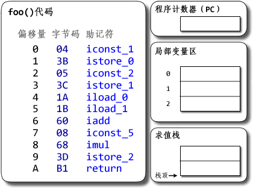
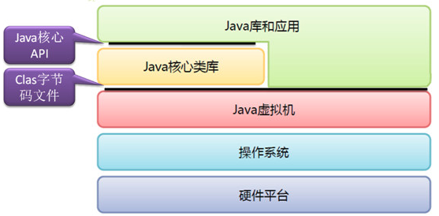
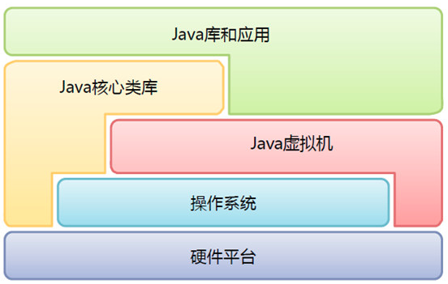
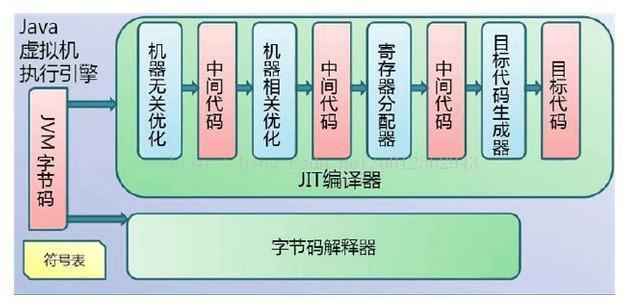

## JVM执行引擎

JVM字节码的执行是由JVM执行引擎驱动的，执行引擎与操作系统的API交互。

执行引擎一条条将字节码指令（每个字节码指令都由一个1字节的操作码和附加的操作数组成）解析成机器码，并通过调用系统的指令集来操作系统的硬件资源

## JVM方法执行过程

### 示例代码

```java
public class Demo {
    public static void foo() {
       int a = 1;
       int b = 2;
       int c = (a + b) * 5;
    }
}
```

### 执行过程

执行引擎一行行执行字节码，对局部变量表和操作数栈中的**Variable Slot** 进行操作




> 求值栈即为常说的操作数栈

### 与线程的关系

一个线程对应着一个执行引擎，但一个执行引擎可以对应多个线程

> 我的理解
>
> 可以理解成执行引擎对应的是操作系统分配给JVM进程的CPU核数，是有限的。但JVM创建Java线程不受物理CPU核数的影响。
>
> 当线程数超过CPU核数时，执行引擎就会在不同的Java线程间切换，分配CPU的计算时间给各个线程

线程的执行是执行引擎对线程私有内存数据结构（上下文）的操作

- 读取并执行程序计数器指向的字节码指令，执行完毕后将程序计数器
  - 字节码的读取和执行是顺序的
  - 操作程序计数器指针的目的是在对线程环境下，执行引擎切换线程时，**保存线程执行到那一步**
- 方法调用栈顶端的栈桢：作为执行引擎执行当前方法的执行环境

### Java字节码与OS系统调用指令

#### Java字节码

`.java`代码经过javac编译之后得到的`.class`文件

class文件中包含类的相关定义信息、常量以及方法的执行逻辑编译的字节码指令集

在jvm运行时，class文件会被加载到方法区

执行引擎执行的是当前方法中一条条字节码指令

> 扩展阅读：[class字节码结构](/2019/12/02/Java-JVM-class-bytecode/) 、 [字节码指令表](/static/Java字节码指令表/)

#### 汇编码（机器指令）

JVM执行引擎在执行字节码指令，会使用字节码解释器将字节码指令**翻译**成宿主系统可以执行的系统调用指令

来调用系统的硬件资源，来实现计算和IO

这个执行引擎翻译的过程也是Java比C++/Golang执行效率低的原因

> JDK1.2之前
>
> 
>
> JDK1.2之后
>
> 
>
> 从JDK1.2开始，迫于Java运行始终比C++慢的压力，JVM的结构也慢慢发生了一些变化，JVM在某些场景下可以操作一定的硬件平台，一些核心的Java库甚至也可以操作底层的硬件平台
>
> 比如nio，零拷贝等特性


### 执行引擎组成

执行引擎由**字节码解释器**，**模板解释器**以及**JIT即时编译器**组成



#### 字节码解释器

JVM内部的**一条一条**地读取、解释并且执行字节码指令。

它一条一条地解释和执行指令，所以它可以很快地解释字节码，但是执行起来会比较慢。

这是解释执行的语言的一个缺点。字节码这种“语言”基本来说是解释执行的。

- 程序启动时首先发挥作用，解释执行Class字节码
- 省去编译时间，**加快启动速度**
- 但**执行效率较低**

##### 模板解释器

 `templateTable*`  +  `templateInterpreter*`

模板解释器是一堆**本地码**的例程(routines 映射关系表)，它会在虚拟机创建的时候初始化好。

也就是说，模板解释器在初始化的时候会申请一片内存并设置为可读可写可执行，然后向那片内存写入本地码。在解释执行字节码指令时，会查找映射关系表找到对应的机器码片段，然后执行那片内存里面的二进制代码

##### C++解释器

`bytecodeInterpreter*` + `cppInterpreter*`

原理上使用**c++代码模拟Java字节码指令**的执行

#### JIT即时编译器 - Just In Time Compiler

> 即时编译器被引入用来弥补解释器执行效率低的缺点。

执行引擎首先按照解释执行的方式来执行，然后在合适的时候，即时编译器把整段字节码编译成本地代码。然后，执行引擎就没有必要再去解释执行方法了，它可以直接通过本地代码去执行它。

> 执行本地代码比一条一条进行解释执行的速度快很多。编译后的代码可以执行的很快，因为本地代码是保存在缓存里的。

- 程序解释运行后，JIT编译器逐渐发挥作用
- 编译成本地代码，提高执行效率
- 但占用程序运行时间、内存等资源

但是即时编译的成本也很高，JVM会判断**热点代码**进行JIT

参考

[字节码执行引擎](https://www.cnblogs.com/royi123/p/3569511.html)

