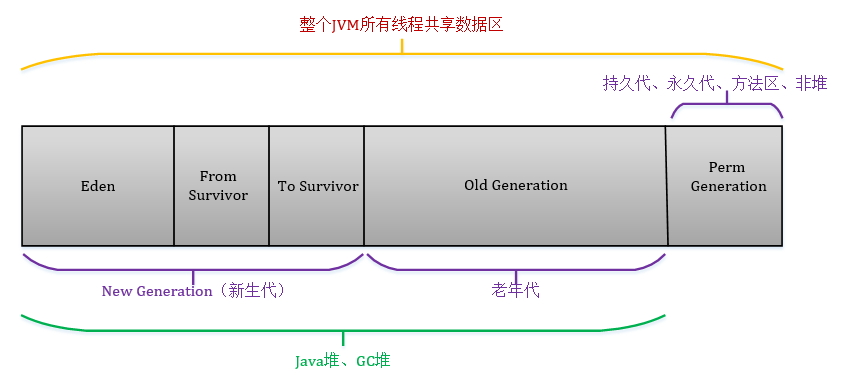

# JVM整体概览

# JVM数据区域

> JVM内存模型区别于Java内存模型JMM

JVM**运行时**数据区域划分

- 线程共享
  - 堆
  
  - Java 8之前 永久带
    
    - 常量池
    - 类信息
    
  - java 8之后 方法区 matespace
    
    只存放类信息，常量池被移到堆内存
- 线程独占
  - 虚拟机栈
  - 本地方法栈
  - 程序计数器

## 线程共享

### 方法区 Method Area

方法区属于线程共享的内存区域，又称Non-Heap（非堆），主要用于存储已被虚拟机加载的类信息、常量、静态变量、即时编译器编译后的代码等数据

> #### 永久代 PermGem
>
> java8之前方法区称为永久代，Java8之后被废除，替换为Metaspace(本地内存中) 
>
> - PermGem有大小限制，当JVM中动态代理生成太多class对象，就会抛出` java.lang.OutOfMemoryError:PermGenspace `
>
> - Metaspace不在JVM中，不受JVM的内存大小限制

####  运行时常量池（Run-Time Constant Pool） 

方法区的一部分。Java的常量池可以存放各种常量信息，不管是编译期生成的各种字面量，还是需要在运行时决定的符号引用，所以它比一般语言的符号表存储的信息更加宽泛。
程序运行期间，静态存储的数据将随时等候调用。可用`static关键字`指出一个对象的特定元素是静态的。但Java对象本身永远都不会置入静态存储空间。 

### 堆 Heap

Java内存管理的核心区域，用来放置Java对象实例，几乎所有创建的Java对象实例都是被直接分配在堆上。堆被**所有的线程共享** 

#### 新生代 NewGen

年轻代又分为Eden和Survivor区。Survivor区由FromSpace和ToSpace组成。Eden区占大容量，Survivor两个区占小容量，默认比例是8:1:1 

##### Eden 伊甸园

绝大多数新建的对象都“出生在”Eden ，占用内存很大的对象，会被直接在老年代创建

> 代码的写法会决定对象的声明周期，要根据不同的场景选择
>
> - 在方法中new出来的对象，当方法执行完毕之后，就会失去引用，被垃圾回收
> - 被定义为类的静态变量，其引用一直存在方法区的常量池中，不会被垃圾回收，经过几次GC后进入老年代

##### Survivor 幸存者

分为两个大小相同的区域，称为FromSpace和ToSpace。用来放置Minor GC复制-清除算法存活下来的对象

> 用于复制-清除算法，为了解决碎片化。

#### 老年代 OldGen

放置长生命周期的对象，通常都是从Survivor区域拷贝过来的对象（Survivor区存活了多次Minor GC）；也可能是占用内存很大的对象，在创建的时候被直接放到老年代； 

> 被Spring容器管理的Bean都会在老年代中

#### 相关启动参数

> - `-Xmx value` 最大堆体积
> - `-Xms value` 初始的最小堆体积
> - `-XX:NewRatio=value` 老年代和新生代的比例
>   默认情况下，这个数值是3，意味着老年代是新生代的3倍大；换句话说，新生代是堆大小的1/4。
> - `-XX:NewSize=value` 新生代大小
>   可以不用比例的方式调整新生代的大小，直接指定下面的参数，设定具体的内存大小数值
> - `-XX:SurvivorRatio=value`
>   Eden和Survivor的大小是按照比例设置的，如果SurvivorRatio是8，那么Survivor区域就是Eden的1/8大小，也就是新生代的1/10，因为YoungGen=Eden + 2*Survivor

#### 对象数据结构

##### 对象头（Header）

存放一个对象的元数据，例如：对应的类、HashCode、GC分代年龄计数、锁状态标志

- markword 用来存储对象的运行时状态数据，如哈希码（HashCode）、GC分代年龄、锁状态标志、线程持有的锁、偏向线程ID、偏向时间戳等
- klass 类指针 确定该对象是属于哪个对象
- length 如果对象是一个Java数组，那在对象头中还必须有一块用于记录数组长度的字段

##### 实例数据 （Instance Data）

对象真正存储的有效信息，也是程序代码中所定义的各种类型的字段内容。无论是从父类继承下来的，还是在子类中定义的，都需要记录下来。这部分的存储顺序会受到虚拟机分配策略参数（FieldAllocationStyle）和字段在Java源码中定义顺序的影响

##### 对齐填充（Padding）

起到占位符的作用

> HotSpot VM 中规定对象起始地址必须是8字节的整数倍，即每个对象的大小必须是8字节的整数倍
>
> 对象头部分正好是8字节的倍数（1倍或者2倍），因此，当对象实例数据部分没有对齐时，就需要通过对齐填充来补全

## 线程私有内存区域

每启动一个**线程**都会给线程分配一块内存区域来存储程序计数器和方法调用栈

### 程序计数器（PC，Program Counter Register）

指向线程当前方法**正在执行**的**字节码指令**(存放在Class对象的方法属性中)

> 每个线程都有它自己的程序计数器，并且任何时间一个线程都只有一个方法在执行，也就是所谓的**当前方法**
>
> 程序计数器会存储当前线程正在执行的Java方法的JVM指令地址；或者，如果是在执行native方法，则是未指定值（undefined） 

#### 作用 - 多线程CPU上下文切换

线程是一个抽象概念，CPU的计算资源会在多个线程间切换，当线程让出计算资源时，线程会进入挂起状态；当线程再次获得计算资源，线程会读取程序计数器指向的JVM指令继续执行

当CPU资源在多个线程间换时，程序计数器和虚拟机栈用来**保存线程执行的上下文**

> JAVA代码编译后的字节码在未经过JIT（实时编译器）编译前，其执行方式是通过“字节码解释器”进行解释执行。简单的工作原理为解释器读取装载入内存的字节码，按照顺序读取字节码指令。读取一个指令后，将该指令“翻译”成固定的操作，并根据这些操作进行分支、循环、跳转等流程。
>
> 从上面的描述中，可能会产生程序计数器是否是多余的疑问。因为沿着指令的顺序执行下去，即使是分支跳转这样的流程，跳转到指定的指令处按顺序继续执行是完全能够保证程序的执行顺序的。假设程序永远只有一个线程，这个疑问没有任何问题，也就是说并不需要程序计数器。但实际上程序是通过多个线程协同合作执行的。
>
> 首先我们要搞清楚JVM的多线程实现方式。JVM的多线程是通过CPU时间片轮转（即线程轮流切换并分配处理器执行时间）算法来实现的。也就是说，某个线程在执行过程中可能会因为时间片耗尽而被挂起，而另一个线程获取到时间片开始执行。当被挂起的线程重新获取到时间片的时候，它要想从被挂起的地方继续执行，就必须知道它上次执行到哪个位置，在JVM中，通过程序计数器来记录某个线程的字节码执行位置。因此，程序计数器是具备线程隔离的特性，也就是说，每个线程工作时都有属于自己的独立计数器。

### Java虚拟机栈（Java Virtual Machine Stack）

每个线程在创建时都会创建一个虚拟机栈，其内部保存一个个的栈帧（Stack Frame），对应着一次次的Java方法调用

#### 栈帧（Stack Frame）

栈帧（Stack Frame） 是用来支持线程的方法调用和执行的**数据结构**。用来表征线程的**方法调用链**，

调用链上每一个方法从调用到方法返回都对应着一个栈帧入栈出栈的过程。

##### 当前栈桢

在活动线程中，只有**栈顶的栈帧**才是有效的，称为当前栈帧。

这个栈帧所关联的方法称为**当前方法**，执行引擎所运行的所有的字节码指令都只针对当前栈帧进行操作。 

虚拟机栈中其他的栈桢对应的方法都处于执行状态，等待上方栈桢对应的方法执行返回

> 我的理解
>
> - 这里的方法调用指的是JVM指令（class文件通过javap反编译）
> - java主线程的方法调用栈的**最底部**为java入口函数（main方法）；子线程的方法调用栈的最底部为run方法
> - 虚拟机栈顶端的栈桢是线程当期正在执行的方法的上下文

#### 栈帧内部结构

##### 局部变量表 Local Variable Table

存放方法参数列表和方法内部定义的局部变量

- 为一组变量值存储空间，用于存放方法参数和方法内定义的局部变量。
- 最小单位变量槽（**Variable Slot**）8种数据类型
  - boolean
  - byte
  - char
  - short
  - int
  - float
  - **reference**
  - returnAddress 

##### 操作数栈 Operand Stack

数据结构为后入先出LIFO结构

方法执行过程中，会有各种字节码指令往操作栈中写入和提取内容，即入栈、出栈操作。

> 可以理解成**执行引擎的”草稿纸“**

##### 动态连接 Dynamic Linking

一个指向运行时常量池中该栈帧所属方法的指针，支持方法调用过程的动态链接。

##### 返回地址

退出当前方法执行有两种方式

- **正常返回**

  执行引擎遇到任意一个方法返回的字节码指令

  返回值传递给上层的方法调用者（**将返回值压入到调用者栈桢的操作数栈中**）

- **异常返回**

  程序执行遇到异常，并且没有try catch处理

  这种情况下不会给上层调用者返回值

退出当前方法后，返回值传递给上层的方法调用者并且将

### 本地方法栈（Native Method Stack） 

本地方法栈属于线程私有的数据区域，这部分主要**与虚拟机用到的 Native 方法相关**，一般情况下，我们无需关心此区域。

