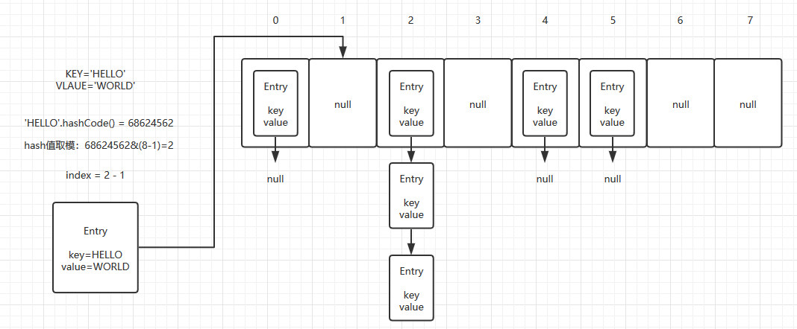

# 数据结构

> 数据结构的物理存储结构只有两种：**顺序存储结构**和**链式存储结构**（像栈，队列，树，图等是从逻辑结构去抽象的，**映射到内存中，也这两种物理组织形式**）
>
> - 顺序存储 Array 
>   - 优点：便于查找（时间复杂度O(1)）、存储密度大
>   - 缺点：插入和删除效率低
> - 链式存储 Linked
>   - 优点：插入和删除效率高
>   - 缺点：查询效率低（时间复杂度O(n)）

HashMap是以数组为基础实现的。比如我们要新增或查找某个元素，我们通过**把当前元素的特征（key） 通过某个函数映射到数组中的某个位置**，通过数组下标一次定位就可完成操作

**存储位置（数组index） = f(关键字、元素的特征)**   其中，这个函数f一般称为**哈希函数**

## 数组+链表

### 哈希冲突

当我们对某个元素进行哈希运算，得到一个存储地址，然后要进行插入的时候，发现已经被其他元素占用了，其实这就是所谓的**哈希冲突**，也叫**哈希碰撞**。

哈希函数的设计至关重要，好的哈希函数会尽可能地保证 **计算简单**和**散列地址分布均匀,**但是，数组是一块**连续**的**固定长度**的内存空间，再好的哈希函数也不能保证得到的存储地址绝对不发生冲突。而HashMap即是采用了链地址法，也就是**数组+链表**的方式 来解决哈希碰撞

HashMap由**数组+链表**组成的：数组是HashMap的主体，**链表则是主要为了解决哈希冲突而存在的**



#### 寻址流程

如果定位到的数组位置不含链表（当前entry的next指向null）,那么对于查找，添加等操作很快，仅需一次寻址即可

如果定位到的数组包含链表，对于添加操作，其时间复杂度为O(n)，首先遍历链表，存在即覆盖，否则新增；对于查找操作来讲，仍需遍历链表，然后通过key对象的equals方法逐一比对查找。所以，性能考虑，HashMap中的链表出现越少，性能才会越好

#### 确定存储位置的流程


## 基本数据结构

### Entry Java8之前

HashMap的主干是一个Entry数组（table）

```java
//HashMap的主干数组，可以看到就是一个Entry数组，初始值为空数组{}，主干数组的长度一定是2的次幂
transient Entry<K,V>[] table = (Entry<K,V>[]) EMPTY_TABLE;
```

Entry是HashMap的基本组成单元，每一个Entry包含：

- 一个**key-value键值对**
- 下一个entry的指针
- key的hashcode

Entry是HashMap中的一个静态内部类

```java
static class Entry<K,V> implements Map.Entry<K,V> {
    final K key;
    V value;
    Entry<K,V> next;//存储指向下一个Entry的引用，单链表结构
    int hash;//对key的hashcode值进行hash运算后得到的值，存储在Entry，避免重复计算

    /**
      * Creates new entry.
      */
    Entry(int h, K k, V v, Entry<K,V> n) {
        value = v;
        next = n;
        key = k;
        hash = h;
    } 
}
```

### Node Java8之后

当链表过长后（超过8），会将链表树化，以提高查询效率

- 遍历查询链表时间复杂度为**O(n)**

- 查询红黑树的时间复杂度为**O(logn)**

```java
transient Node<K,V>[] table;

static class Node<K,V> implements Map.Entry<K,V> {
    final int hash;
    final K key;
    V value;
    Node<K,V> next;

    Node(int hash, K key, V value, Node<K,V> next) {
        this.hash = hash;
        this.key = key;
        this.value = value;
        this.next = next;
    }
    ···
}
```


```java
static final class TreeNode<K,V> extends LinkedHashMap.Entry<K,V> {
    TreeNode<K,V> parent;  // red-black tree links
    TreeNode<K,V> left;
    TreeNode<K,V> right;
    TreeNode<K,V> prev;    // needed to unlink next upon deletion
    boolean red;
    TreeNode(int hash, K key, V val, Node<K,V> next) {
        super(hash, key, val, next);
    }
    ···
}
```

# 代码实现

## 重要参数

#### 容量阈值 threshold

当初始化一个空的HashMap对象时，threshold**默认初始值为16**

> 用来衡量hashMap中元素总个数而不是数组的长度

#### 负载因子 DEFAULT_LOAD_FACTOR

用于扩容，默认值为0.75f

### 构造函数

HashMap有4个构造器，其他构造器如果用户没有传入initialCapacity 和loadFactor这两个参数，会使用默认值

initialCapacity默认为16，loadFactor默认为0.75f

在常规构造器中，没有为数组table分配内存空间（有一个入参为指定Map的构造器例外），而是**在执行put操作的时候才真正构建table数组**

```java
public HashMap(int initialCapacity, float loadFactor) {
    //此处对传入的初始容量进行校验，最大不能超过MAXIMUM_CAPACITY = 1<<30(230)
    if (initialCapacity < 0)
        throw new IllegalArgumentException("Illegal initial capacity: " +
                                           initialCapacity);
    if (initialCapacity > MAXIMUM_CAPACITY)
        initialCapacity = MAXIMUM_CAPACITY;
    if (loadFactor <= 0 || Float.isNaN(loadFactor))
        throw new IllegalArgumentException("Illegal load factor: " +
                                           loadFactor);

    this.loadFactor = loadFactor;
    threshold = initialCapacity;

    init();//init方法在HashMap中没有实际实现，不过在其子类如 linkedHashMap中就会有对应实现
}
```

### 初始化数组 inflateTable

inflateTable这个方法用于为主干数组table在内存中分配存储空间

通过roundUpToPowerOf2(toSize)可以确保capacity为大于或等于toSize的最接近toSize的二次幂，比如toSize=13,则capacity=16;to_size=16,capacity=16;to_size=17,capacity=32.

```java
private void inflateTable(int toSize) {
    int capacity = roundUpToPowerOf2(toSize);//capacity一定是2的次幂
    //此处为threshold赋值，取capacity*loadFactor和MAXIMUM_CAPACITY+1的最小值，capaticy一定不会超过MAXIMUM_CAPACITY，除非loadFactor大于1
    threshold = (int) Math.min(capacity * loadFactor, MAXIMUM_CAPACITY + 1);
    table = new Entry[capacity];
    initHashSeedAsNeeded(capacity);
}
```

roundUpToPowerOf2中的这段处理使得数组长度一定为2的次幂，Integer.highestOneBit是用来获取最左边的bit（其他bit位为0）所代表的数值

```java
 private static int roundUpToPowerOf2(int number) {
     // assert number >= 0 : "number must be non-negative";
     return number >= MAXIMUM_CAPACITY
         ? MAXIMUM_CAPACITY
         : (number > 1) ? Integer.highestOneBit((number - 1) << 1) : 1;
 }
```

## 寻址

将hashcode转化成数组table的下标，保证保证最终获取的存储位置**尽量分布均匀**

hash函数计算出的值，通过indexFor进一步处理来获取实际的存储位置

### hash函数

```java
// 对key的hashcode进一步进行计算以及二进制位的调整等来保证最终获取的存储位置尽量分布均匀
final int hash(Object k) {
    int h = hashSeed;
    if (0 != h && k instanceof String) {
        return sun.misc.Hashing.stringHash32((String) k);
    }

    h ^= k.hashCode();

    h ^= (h >>> 20) ^ (h >>> 12);
    return h ^ (h >>> 7) ^ (h >>> 4);
}
```

#### java8之后优化

```java
static final int hash(Object key) {    
    int h;    
    return (key == null) ? 0 : (h = key.hashCode()) ^ (h >>> 16);
}
```

> 原始hashCode int 32位 `1111 1111 1111 1111 1111 1010 0111 1100`
>
> 右移16位  h >>> 16        `0000 0000 0000 0000 1111 1111 1111 1111`
>
> 两者做 异或运算              `1111 1111 1111 1111 0000 0101 1000 0011`
>
> 目的是 让原始的hashCode的**高16位和低16位都参与运算**，让寻址计算带有整个hash值的特征，减少哈希碰撞的发生
>
> 因为后续hash值会与数组长度length进行与运算，**数组长度**的值**不可能超过2的16次方**，所以高16位全部是0（和0做与运算的结果都是0），取模时hash值的**前16位的特征会被丢失**
>
> 比如低16位相同，高16位不同的两个hash值，如果不进行优化，会寻址到相同的下标

### indexFor 寻址

将hash值取模获取index下标

```java
// 以上hash函数计算出的值，通过indexFor进一步处理来获取实际的存储位置
static int indexFor(int h, int length) {
    // 保证获取的index一定在数组范围内 不会越界
    // 举个例子，默认容量16，length-1=15 ，h=18 二进制与运算后得到 2
    return h & (length - 1);
}
```

> 与运算 有0则0
>
> ```
>         1  0  0  1  0    = 18
>     &   0  1  1  1  1    = 15
>     __________________
>         0  0  0  1  0    = 2
> ```


#### 寻址优化的前提：数组长度 必须是2的幂

hashMap实现中使用位运算`hashCode & (length - 1)`寻址，对比直接取模`hashCode % length`进行了优化，**提高运算性能**

但这两种取模方式**等价的前提**是length必须是2的幂

## put 

第一次调用put方法时，真正初始化数组 开辟内存空间

```java
public V put(K key, V value) {
    //如果table数组为空数组{}，进行数组填充（为table分配实际内存空间），入参为threshold，此时threshold为initialCapacity 默认是1<<4(24=16)
    if (table == EMPTY_TABLE) {
        inflateTable(threshold);
    }
    //如果key为null，存储位置为table[0]或table[0]的冲突链上
    if (key == null)
        return putForNullKey(value);
    int hash = hash(key);//对key的hashcode进一步计算，确保散列均匀
    int i = indexFor(hash, table.length);//获取在table中的实际位置
    for (Entry<K,V> e = table[i]; e != null; e = e.next) {
        //如果该对应数据已存在，执行覆盖操作。用新value替换旧value，并返回旧value
        Object k;
        if (e.hash == hash && ((k = e.key) == key || key.equals(k))) {
            V oldValue = e.value;
            e.value = value;
            e.recordAccess(this);
            return oldValue;
        }
    }
    modCount++;//保证并发访问时，若HashMap内部结构发生变化，快速响应失败
    addEntry(hash, key, value, i);//新增一个entry
    return null;
}    
```

### addEntry 添加元素

添加元素之前，检查hashMap当前的元素个数是否超过扩容阈值，并且发生了哈希冲突，则先进行扩容

```java
void addEntry(int hash, K key, V value, int bucketIndex) {
    //当size超过临界阈值threshold，并且即将发生哈希冲突时进行扩容
    if ((size >= threshold) && (null != table[bucketIndex])) {
        resize(2 * table.length);
        hash = (null != key) ? hash(key) : 0;
        bucketIndex = indexFor(hash, table.length);
    }
    createEntry(hash, key, value, bucketIndex);
}
```

### resize 扩容

当发生哈希冲突并且size大于阈值的时候，需要进行数组扩容

扩容时，需要新建一个**长度为之前数组2倍**的新的数组，然后将当前的Entry数组中的元素全部传输过去，并进行rehash重新分配在数组中的位置，所以扩容相对来说是个耗资源的操作。

```java
 void resize(int newCapacity) {
     Entry[] oldTable = table;
     int oldCapacity = oldTable.length;
     if (oldCapacity == MAXIMUM_CAPACITY) {
         threshold = Integer.MAX_VALUE;
         return;
     }

     Entry[] newTable = new Entry[newCapacity];
     transfer(newTable, initHashSeedAsNeeded(newCapacity));
     table = newTable;
     threshold = (int)Math.min(newCapacity * loadFactor, MAXIMUM_CAPACITY + 1);
 }
```

### transfer 转移

将老数组中的数据逐个链表地遍历，扔到新的扩容后的数组中，我们的数组索引位置的计算是通过 对key值的hashcode进行hash扰乱运算后，再通过和 length-1进行位运算得到最终数组索引位置

hashMap的数组长度一定保持2的次幂，比如16的二进制表示为 10000，那么length-1就是15，二进制为01111，同理扩容后的数组长度为32，二进制表示为100000，length-1为31，二进制表示为011111。从下图可以我们也能看到这样会保证低位全为1，而扩容后只有一位差异，也就是多出了最左位的1，这样在通过 h&(length-1)的时候，只要h对应的最左边的那一个差异位为0，就能保证得到的新的数组索引和老数组索引一致(大大减少了之前已经散列良好的老数组的数据位置重新调换)，个人理解。

```java
void transfer(Entry[] newTable, boolean rehash) {
    int newCapacity = newTable.length;
    //for循环中的代码，逐个遍历链表，重新计算索引位置，将老数组数据复制到新数组中去（数组不存储实际数据，所以仅仅是拷贝引用而已）
    for (Entry<K,V> e : table) {
        while(null != e) {
            Entry<K,V> next = e.next;
            if (rehash) {
                e.hash = null == e.key ? 0 : hash(e.key);
            }
            int i = indexFor(e.hash, newCapacity);
            //将当前entry的next链指向新的索引位置,newTable[i]有可能为空，有可能也是个entry链，如果是entry链，直接在链表头部插入。
            e.next = newTable[i];
            newTable[i] = e;
            e = next;
        }
    }
}
```

## get

get方法通过key值返回对应value，如果**key为null，直接去table[0]处检索**

### getEntry/getNode

get方法的实现相对简单 key(hashcode) > hash > indexFor > 最终索引位置

- 通过key的hash值寻址到找到对应的桶位置
- 在桶中通过key对象的**hashCode和equals方法**比对，找到对应的Entry或Node，获取对应的value
  - 如果是链表，则遍历链表
  - 如果是红黑树，则查询红黑树

> 要注意的是，有人觉得上面在定位到数组位置之后然后遍历链表的时候，e.hash == hash这个判断没必要，仅通过equals判断就可以。其实不然，试想一下，如果传入的key对象重写了equals方法却没有重写hashCode，而恰巧此对象定位到这个数组位置，如果仅仅用equals判断可能是相等的，但其hashCode和当前对象不一致，这种情况，根据Object的hashCode的约定，不能返回当前对象，而应该返回null，后面的例子会做出进一步解释。

#### equals和hashCode

hashMap get方法的查找逻辑，会判断hashCode和equals方法，如果两者没有达成一致

**在重写equals的方法的时候，必须注意同时重写hashCode方法，同时还要保证通过equals判断相等的两个对象，调用hashCode方法要返回同样的整数值**。而如果equals判断不相等的两个对象，其hashCode可以相同（只不过会发生哈希冲突，应尽量避免）

如果我们已经对HashMap的原理有了一定了解，这个结果就不难理解了。尽管我们在进行get和put操作的时候，使用的key从逻辑上讲是等值的（通过equals比较是相等的），但由于没有重写hashCode方法，所以put操作时，key(hashcode1)-->hash-->indexFor-->最终索引位置 ，而通过key取出value的时候 key(hashcode1)-->hash-->indexFor-->最终索引位置，由于hashcode1不等于hashcode2，导致没有定位到一个数组位置而返回逻辑上错误的值null（也有可能碰巧定位到一个数组位置，但是也会判断其entry的hash值是否相等，上面get方法中有提到。）

[参考1](https://www.cnblogs.com/peizhe123/p/5790252.html)