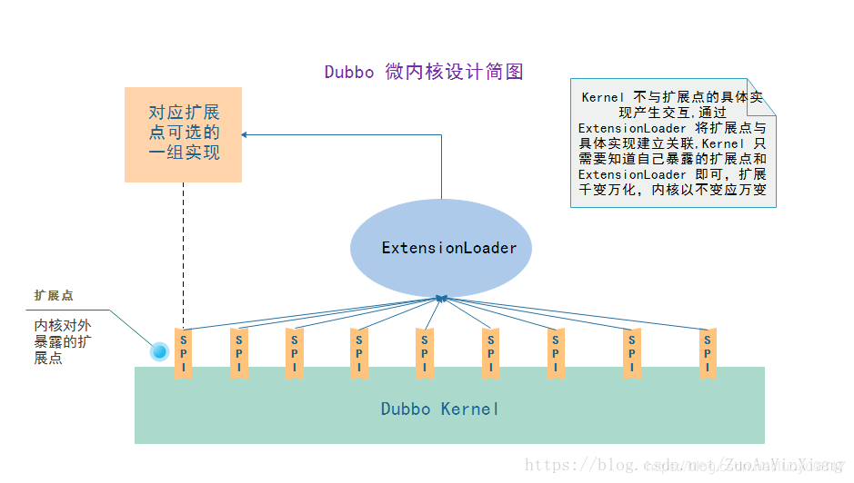
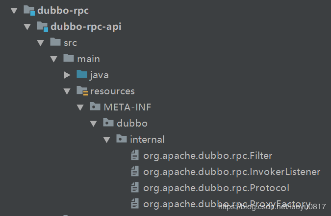
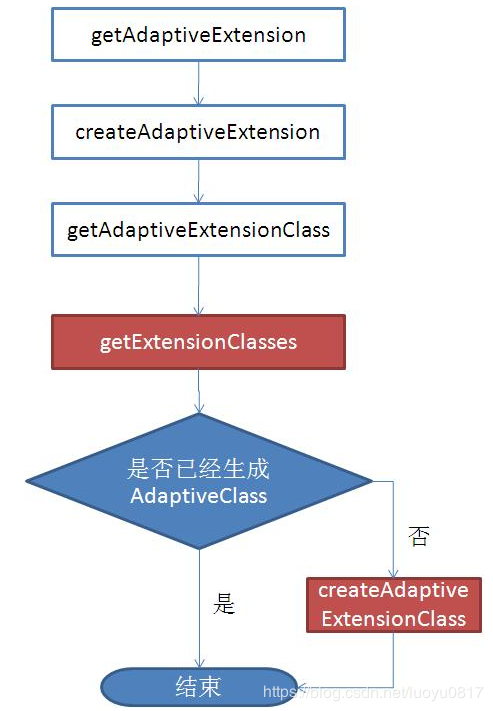

# 前言

依赖自动发现机制是为了提高程序的扩展性，降低代码的耦合度。在不对核心代码做修改和配置的前提下，只需在classpath下添加依赖，就能将插件接入到系统中。

> 遵循的基本原则
>
> * **面向接口编程**
>
>   核心代码面向接口编程
>
> * **约定大于配置**
>
>   根据约定目录下的配置，读取并加载接口实现类

# JDK自带的SPI

SPI 全称为 (**Service Provider Interface**) ,是JDK内置的一种服务提供发现机制（动态替换接口实现)

> java spi的具体约定为:当服务的提供者，提供了服务接口的一种实现之后，在jar包的META-INF/services/目录里同时创建一个以服务接口命名的文件。该文件里就是实现该服务接口的具体实现类。而当外部程序装配这个模块的时候，就能通过该jar包META-INF/services/里的配置文件找到具体的实现类名，并装载实例化，完成模块的注入。 基于这样一个约定就能很好的找到服务接口的实现类，而不需要再代码里制定。jdk提供服务实现查找的一个工具类：java.util.ServiceLoader

通常用来为框架提供扩展性、兼容性和第三方插件接口：最常见的就是JDBC驱动，不同的数据厂家对应不同的驱动

例如，  有个接口，想运行时动态的给它添加实现，你只需要添加一个实现的依赖包到classpath，在这个依赖包工程中，通过一个文件**声明**实现类与SPI的对应关系

> 在classpath下的`MATE-INF/services`目录下创建一个文件，文件名为JDK的SPI全路径名，文件内容为当前依赖包中的该SPI的实现类（可以有多个，用逗号隔开）。文件编码必须是UTF-8

当JVM启动时，会扫描classpath `MATE-INF/services`目录下所有的文件，得到SPI与实现类的映射关系

通过ServiceLoader来加载SPI对应的实现类

```java
ServiceLoader<HelloInterface> loaders = ServiceLoader.load(HelloInterface);
for (HelloInterface hello : loaders) {
    hello.sayHello();
}
```

# Dubbo实现的SPI

Dubbo的扩展机制是基于SPI思想来实现的，但是并没有采用JDK中原生的SPI机制，因为JDK中SPI具有很大的缺点：

JDK中标准的SPI会**一次性实例化扩展点所有的实现类**，不管这些实例化出来的扩展点实现有没有被用到。有的扩展点实现初始化时非常的耗时，即使没有用到也会被加载，这样就很浪费资源

## Dubbo中的SPI概述

Dubbo的SPI机制中增加了对扩展点IOC和AOP的支持，一个扩展点可以直接setter注入到其他的扩展点中

弥补了上述JDK中SPI的缺点，**结合Spring的设计思想，细粒度的控制扩展实现类的实例化**

### SPI在dubbo中的用处

Dubbo作为灵活的框架，并不会强制所有用户都一定使用Dubbo提供的某些架构，**提供用户自定义插件的接入**

> 例如注册中心（Registry），Dubbo提供了zk和redis，但是如果我们更倾向于其他的注册中心的话，我们**可以替换掉Dubbo提供的注册中心**，可以写一个类似eureka server的注册中心，替换默认的zk
>
> 切换zk和redis，只用在应用层使用dubbo提供的api进行配置；如果想要使用其他的注册中心实现，可以利用dubbo的SPI机制，添加自定义的注册中心实现依赖

针对这种可被替换的技术实现点我们称之为**扩展点**，类似的扩展点还有很多，例如Protocol，Filter，Loadbalance等等

### 微内核

微内核架构 （Microkernel architecture） 模式也被称为**插件架构** （Plugin architecture） 模式

> 原本与内核集成在一起的组件会被分离出来，内核提供了特定的接口使得这些组件可以灵活的接入，这些组件在内核的管理下工作，但是这些组件可以独立的发展、更改（不会对现有系统造成改动），只要符合内核的接口即可。典型的例子比如,Eclipse,IDEA 

Dubbo内核对外暴露出扩展点，通过扩展点可以实现定制的符合自己业务需求的功能

Dubbo内核**通过ExtensionLoader扩展点加载器**来加载各个SPI扩展点。Dubbo内核对扩展是无感的 ，完全不知道扩展的存在 ，内核代码中不会出现使用具体扩展的硬编码



### 术语

#### 扩展点

dubbo中被`@SPI`注解的接口被称为扩展点

#### 扩展

被 @SPI 注解的 Interface 的实现称为这个扩展点的一个扩展

## 实现原理

以rpc模块为例

### 规约

#### 扩展点约定

扩展点必须是 Interface 类型 ，必须被 `@SPI` 注解 ，满足这两点才是一个扩展点

#### 扩展定义约定

dubbo会读取classpath下，下列三个目录下的配置文件，读取接口的实现类路径

这些路径下定义的文件名称为 `$扩展点接口的全类名`（当前项目中定义的SPI接口-被`@SPI`标记）

-  `META-INF/services/$扩展点接口的全类名`（兼容Java自带的SPI）

- `META-INF/dubbo/$扩展点接口的全类名`（建议的外部SPI配置存放路径）

- `META-INF/dubbo/internal/$扩展点接口的全类名 `（dubbo内部实现）



 

```java
package org.apache.dubbo.rpc;

import org.apache.dubbo.common.URL;
import org.apache.dubbo.common.extension.Adaptive;
import org.apache.dubbo.common.extension.SPI;

/**
 * Protocol. (API/SPI, Singleton, ThreadSafe)
 */
@SPI("dubbo")
public interface Protocol {

    int getDefaultPort();

    @Adaptive
    <T> Exporter<T> export(Invoker<T> invoker) throws RpcException;

    @Adaptive
    <T> Invoker<T> refer(Class<T> type, URL url) throws RpcException;

    void destroy();

}
```

文件内容是以**键值对**的方式配置扩展点的扩展实现:

```properties
echo=org.apache.dubbo.rpc.filter.EchoFilter
generic=org.apache.dubbo.rpc.filter.GenericFilter
genericimpl=org.apache.dubbo.rpc.filter.GenericImplFilter
token=org.apache.dubbo.rpc.filter.TokenFilter
accesslog=org.apache.dubbo.rpc.filter.AccessLogFilter
activelimit=org.apache.dubbo.rpc.filter.ActiveLimitFilter
classloader=org.apache.dubbo.rpc.filter.ClassLoaderFilter
context=org.apache.dubbo.rpc.filter.ContextFilter
consumercontext=org.apache.dubbo.rpc.filter.ConsumerContextFilter
exception=org.apache.dubbo.rpc.filter.ExceptionFilter
executelimit=org.apache.dubbo.rpc.filter.ExecuteLimitFilter
deprecated=org.apache.dubbo.rpc.filter.DeprecatedFilter
compatible=org.apache.dubbo.rpc.filter.CompatibleFilter
timeout=org.apache.dubbo.rpc.filter.TimeoutFilter
```

**默认适应扩展** 

Protocol SPI被标记了@SPI("dubbo")，表示Protocol的实现类默认使用DubboProtocol

其实dubbo和实现类DubboProtocol关系类似Spring配置文件中的id和class的关系，不同的是Dubbo的关系是配置在目录`/META_INF/dubbo/internal/com.alibaba.dubbo.rpc.Protocol`文件中，文件内容为：

```properties
dubbo=com.alibaba.dubbo.rpc.protocol.dubbo.DubboProtocol
http=com.alibaba.dubbo.rpc.protocol.http.HttpProtocol
hessian=com.alibaba.dubbo.rpc.protocol.hessian.HessianProtocol
```

实现机制就类似Spring的bean注入，通过key(dubbo、http、hessian)来找到其实现类

### 扩展加载器 `ExtensionLoader<T>`

扩展加载器控制着 dubbo 内部所有扩展点的初始化、加载扩展的过程

ExtensionLoader 中会维护两个静态ConcurrentMap变量 作为缓存 ：

- EXTENSION_LOADERS 

  保存了内核开放的SPI扩展点对应的 ExtensionLoader实例对象 （一种扩展点有一个对应的 ExtensionLoader 对象）

  - `key`      SPI接口的Class对象
  - `value`  对应的ExtensionLoader

- EXTENSION_INSTANCES 

  保存了扩展类型 （Class） 和扩展类型的实例对象

  是一对一而不是Java自带SPI机制的一对多

  根据SPI注解的默认设置或者用户配置，最终加载一个SPI扩展实现

  - `key`      SPI接口的Class对象
  - `value`  SPI扩展实现

#### API

##### `static getExtensionLoader(SPIClass)`

ExtensionLoader通过`getExtensionLoader(Class<T> SPIClass)`静态方法暴露获取SPI实现类的API

以懒加载的模式获取SPIClass对应的ExtensionLoader实例

##### `hasExtension(SPIName)`

获取SPI扩展点前，检查classpath下是否有对应的实例

##### `getExtension(SPIName)`

获取SPI扩展点实例



# SpringBoot的组件自动装配

### `spring-boot-starter-XXX`

在使用SpringBoot构建项目时，当需要某个领域的功能时（例如web服务、数据访问等），只需要在classpath下添加（pom配置文件配置）相应的spring-boot-starter-xxx依赖，然后在启动类添加开启对应的组件功能的注解（`@EnableXxx`和`XxxAutoCinfiguration`），就可以将组件接入到SpringBoot中

SpringCloud就是利用这种机制，在SpringBoot的基础上开发的微服务工具集

## 实现

`spring-boot-starter-XXX`中没有任何业务实现，作为**桥接器**，将组件功能接入到SpringBoot中(被封装成bean注入到容器中)

> SpringBoot与前两种SPI模式模式的不同在于不是简单的面向接口，而是面向Spring上下文（通过bean注入和取用的方式来调用组件功能），耦合度更低

### 桥接逻辑

#### 配置依赖

配置`spring-boot-starter-XXX`的pom文件，添加这个组件具体实现的依赖，以及AutoConfiguration的相关依赖

#### 定义桥接逻辑

##### XxxAutoConfiguration ①

由`@Configuration`标记

在配置类中完成：**加载配置**、环境检查、第三方功能入口bean

##### XxxConfiguration ②

实现ApplicationContextAware

获取操作上下文能力

### 组件注册

通过元数据的配置(`/MATE-INF/spring.factories`或注解)的方式来注册组件

#### 配置`spring.factories` ①

在starter组件工程的classpath下创建`/MATE-INF/spring.factories`，在这个文件中配置自定义的AutoConfiguration类

```java
# Auto Configure
org.springframework.boot.autoconfigure.EnableAutoConfiguration=org.xxx.XXXAutoConfiguration
```

#### 添加@EnableXxx ②

在`spring-boot-starter-XXX`中定义，通过`@Import`指定对应的**Configuration**类（与AutoConfiguration实现不同，Configuration是实现ApplicationContextAware来获取**对上下文applicationContext的操作能力**）

所以这个模式的操作空间更多

```java
@Retention(RetentionPolicy.RUNTIME)
@Target(ElementType.TYPE)
@Documented
@Import(DelegatingWebMvcConfiguration.class)
public @interface EnableWebMvc {
}
```

### 加载接入

在SpringBoot应用启动时，**spring boot会遍历在各个jar包种META-INF目录下的spring.factories文件，构建成一个配置类链表**（按@AutoConfigureAfter的顺序）,然后按顺序执行配置类，将符合条件的bean注入到SpringBoot中的容器中