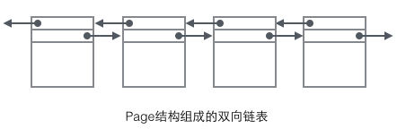
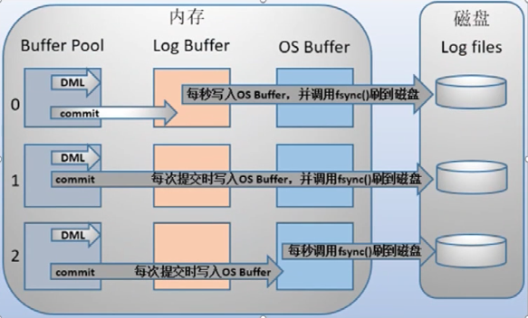

# 常见存储引擎概述

### InnoDB

- 适用场景
  - 大多数OLTP场景
- **事务型** 支持ACID
  - 不能混合使用事务和非事务存储引擎
  - `begin transaction` >> `commit`
- 存储实现：数据按**主键**聚集存储（**聚集索引**）
  - 必须有主键
  - 其他索引都指向主键，然后进行二次寻址
    - 主键索引 >> 行数据
    - 其他所有 >> 主键索引
- 存储文件：表和索引信息在一个文件中
  - IDB：存储表和索引
  - frm：8.0之后 移除
- 支持行级锁及MVCC
  - 行级锁提高并发性能
  - MVCC：可以并发进行读操作和写操作
  - 支持for udpate
- 支持Btree和自适应Hash索引，支持全文和空间索引
  - Hash索引只使用于等值查询

### MyISAM

Indexed Sequential Access Method

- 适用场景
  - **读操作远大于写操作**的场景
  - 不需要事务

- **非事务型**
- 存储实现：以堆表进行存储 **查询性能好**于innodb
  - **快速读取**：索引的叶子节点**直接指向**的是数据存储的实际位置
    - MYI 中存放的是 索引-数据行物理存储地址的键值对
  - 修改性能差：每次写操作都要维护数据和索引信息
    - 数据越多，写操作效率越低
    - 索引越多，效率越低
- 存储文件：由两个文件组成，分布存储数据和索引
  - MYD 数据
  - MYI 索引
  - frm：表结构信息 8.0之后被删除
- 缺点
  - 不支持事务和**外键**
  - 不能容错 需要经常备份
    - 不能在表损坏（表信息）后恢复数据
    - 磁盘崩溃可以使用工具（MyISAMCHK）来修复数据
  - 占用空间（表格锁定机制优化并发的读写操作）
    - 需要定时使用MyISAMPACK来清理空间
- 使用**表级锁** 读写操作相互阻塞
- 索引
  - Btree
  - 空间索引
  - 全文索引

### CSV

- 适用场景
  - 作为数据交换的中间表使用
    - csv格式文件的通用性
- 非事务型存储引擎
- 所有列必须为**非空**
- 不支持索引
- 文件存储：以CSV文件存储

### Archive

- 适用场景
  - 日志类或数据采集类
  - 数据归档
- 非事务型存储引擎
- 表数据使用zlib进行压缩 **节约空间**
- 只支持insert和select
- 只运行在自增ID上建索引

### Memory

- 适用场景
  - 缓存字典映射表
  - 缓存周期性分析数据
- 非事务型存储引擎
- 数据保存在**内存**中
  - 重启会丢失
  - 没有磁盘io，读取性能好
- 所有字段长度固定
- 支持Btree和Hash索引

# InnoDB
## 存储数据结构
### 数据页
数据页是InnoDB存储的最基本构件，也是InnoDB磁盘管理的最小单位

>  `Innodb_page_size` 分页大小 一次从文件系统读取的大小 默认为**16kb** 
>
> 局部性原理：当访问某一条数据时，之后有很大概率访问该条数据附近数据。每次进行磁盘IO，会读取整个数据页到内存

#### 数据页分类

##### 数据页（B-tree Node）

- 目录页：directory page

  数据页上实现B+树索引的数据结构

  只存储索引信息，不存储具体的数据行

  顺序存储一张表的多个数据页的地址指针
  聚合主键+指针

- 数据页：data page

##### Undo页（Undo Log Page）
Undo log是InnoDB MVCC事务特性的重要组成部分。当我们对记录做了变更操作时就会产生undo记录，Undo记录默认被记录到系统表空间(ibdata)中，但从5.6开始，也可以使用独立的Undo 表空间

[详见](https://blog.csdn.net/qq_39459385/article/details/84644005) 

##### 系统页（System Page）
用于保存mysql系统数据
##### 事务数据页（Transaction System Page）
用于保存事务相关数据
#### 数据页数据结构

##### Page Header
包含数据页的相关元信息

###### Page Number
数据页序号

###### 上下页指针
Page的头部保存了两个指针（Previous Page和Next Page），分别指向前一个Page和后一个Page。链接起来就是一个双向链表的结构

###### Page Type
区分数据页类型

##### User Record

`free space`  用于存放一行行record，根据数据页的类型而变

record以链表的形式组织，链表头尾由固定内容的两条字符串形式的记录来表示："Infimum"代表开头，"Supremum"代表结尾

InnoDB存在4种不同的Record，它们分别是

- 主键索引树非叶节点 - `page directory`
- 主键索引树叶子节点 - 存储数据行
- 辅助键索引树非叶节点 - 非主键索引的 `page directory`
- 辅助键索引树叶子节点 - 非主键索引与主键的对应关系

###### page directory
保存这个数据页中索引列的 ”分段“数据指针

###### row
存储数据行

##### file trailer
文件尾部

### B+树结构
InnoDB中的数据根据主键的顺序，以B+树的结构组织存储

#### 特点

- 非叶子节点只存放索引key
- 一个节点存多个元素（行），降低树的高度（3层），减少查询次数
  - 数据都保存在叶子节点 所有数据都需要经过相同的io次数查询到
- 叶子节点之间添加**链表结构** 便于范围查找

> 树型数据结构对比
>
> - 传统二叉树
>   极端情况二叉树会变成链表
> - 红黑树 平衡二叉树
>   二叉树的层数随数据量的增加而增加，提高查询的io次数
> - B-树：多路搜索树
>   一个节点有多个元素 但元素分散，不便于遍历
> - B+树
>   控制（树的层数）查询的io次数
>   每个元素的查找的io次数都是树的高度
>   元素集中在叶子节点，方便遍历
>
> [图形化数据结构](https://www.cs.usfca.edu/~galles/visualization/Algorithms.html)

#### 基本数据行存储结构
数据行索引通过主键组织存储

B+树的非叶子节点的数据页不保存具体表记录，被缓存在内存中提高查询效率

###### 示意图

##### 非主键索引
InnoDB中的非主键索引，是根据主键创建另一个B+树。

通过索引值找到对应的主键，然后在通过主键找到对应的数据行，这就是所谓的回表

###### 示意图

[参考](https://www.cnblogs.com/williamjie/p/11081081.html)

### 引申：随机读写和顺序读写

#### 随机读写

上述的MySQL InnoDB中数据页的存储结构使用到大量存储地址指针，说明表记录文件存储使用的是随机IO

##### 优点

适用于增删改查（随机读）频繁的场景

##### 缺点

读写性能低

#### 顺序读写

而MySQL中日志类的文件使用的是redo log,binlog这种日志进行的磁盘顺序读写

除此之外，RocketMQ、Kafka、ElasticSearch的文件系统也是使用了顺序读写来实现，来提高性能

##### 优点

读写性能高

顺序读写=读取一个大文件
随机读写=读取多个小文件

- 顺序读写，主要时间花费在了传输时间，而这个时间两种读写可以认为是一样的。
  随机读写，需要多次寻道和旋转延迟。而这个时间可能是传输时间的许多倍。

- 顺序读写，磁盘会预读，预读即在读取的起始地址连续读取多个页面
  （现在不需要的页面也读取了，这样以后用时就不用再读取，当一个页面用到时，大多数情况下，它周围的页面也会被用到）  

  而随机读写，因为数据没有在一起，将预读浪费掉了。

- 文件系统的overhead
  读写一个文件之前，得一层层目录找到这个文件，以及做一堆属性、权限之类的检查。
  写新文件时还要加上寻找磁盘可用空间的耗时。

##### 缺点

不适用于修改/删除较频繁的场景。因为文件顺序读写实现只能追加写，其它的删、改都只能建立在append only的基础上，如删一条数据只能append一个记录，把要删的数据标记为删除，而不能从磁盘中删除原数据

## 事务特性实现

mysql自带的binlog只用用于归档，没有crash-safe能力；InnoDB使用另外一套日志系统来实现事务的ACID特性，保证服务崩溃后能恢复数据的一致性

> 原来的MyISAM没有crash-safe能力，事务执行中服务崩溃对导致数据不一致

### 回滚日志 Undo log 【实现原子性/隔离性】

InnoDB中，在任何数据操作之前，将数据备份到undoLog中。

如果执行出错或者客户端执行了rollback，可以利用undo log中的备份将数据恢复到事务开始之前的状态

#### 原子性 【回滚】

事务的所有操作在数据库中要么全部反映，要么全部不反映

当事务执行失败回滚，根据undo log恢复到记录数据修改前的状态

#### 隔离性  【实现MVCC 其他事务查看事务操作前的版本】

用来做资源隔离，让对数据的读写有顺序

分为共享锁和排他锁

数据**查询**需要对资源加**共享锁**（S）

> 保证**读取过程**中不会被其他事务修改

数据**修改**需要对资源加**排他锁**（x）

> 保证事务在修改数据过程中，不会被其他事务读到或者修改

##### MVCC 多版本并发控制

multipart version concurrency control

在innodb中，当一个事务（A）对数据进行修改时，另一个事务（B）还是可以读到被A上了**排他锁**的值（但是看不到A未提交的修改）

利用到undo log，实际上是读取事务A的undo log中，数据修改前的值

### 重做日志 Redo log 顺序写 【持久性】
在**事务提交之前**，备份一份事务的操作日志在磁盘上，备份成功再允许事务成功提交。当MySQL的实例和介质执行失败的时候，Innodb存储引擎就会使用重做日志文件进行恢复，保证事务的持久性。

redo log 由两部分组成：

- 内存中的重做日志缓冲（redo log buffer） 易丢失
- 重做日志文件（redo log file） 持久化

首先将操作的redo_log放入重做日志缓冲区中，然后按一定的频率将其刷新到重做日志文件。该缓冲区不会设置得很大，因为默认**每一秒刷新一次**到日志文件中

redo_log写入磁盘日志文件是**顺序循环写入**（默认在mysql/data目录下面有两个文件ib_logfile0和ib_logfile1），ib_logfile写满之后，写另外一个，**覆盖**之前的redo_log数据。

在覆盖之前，会通过CheckPoint检查redo_log的数据是否已经被持久化到数据页中。

> 通过配置`innodb_flush_log_at_trx_commit` 来调整 InnoDB刷盘策略（类似RocketMQ的同步刷盘和异步刷盘）
>
> `0`：log buffer将每秒一次地写入log file中，并且log file的flush(刷到磁盘)操作同时进行。该模式下在事务提交的时候，不会主动触发写入磁盘的操作。
>
> `1`：**每次事务提交**时MySQL都会把log buffer的数据写入log file，并且flush(刷到磁盘)中去，该模式为系统默认。
>
> `2`：每次事务提交时MySQL都会把log buffer的数据写入log file，但是flush(刷到磁盘)操作并不会同时进行。该模式下，MySQL会每秒执行一次 flush(刷到磁盘)操作。
>
> - 1不会丢失数据 但是性能最差
>
> - 0、2先写入到系统缓存中，每隔一秒批量写入磁盘，提高io效率
>
>  如果断电或者宕机会丢失这一秒内的数据
>
> 