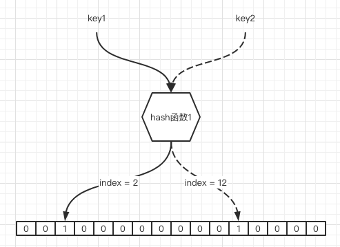
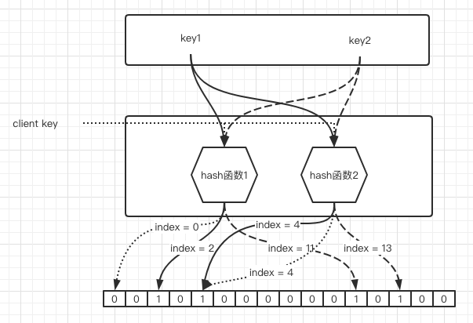
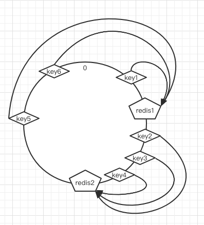
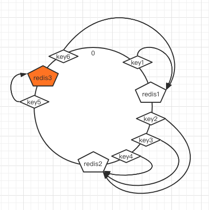
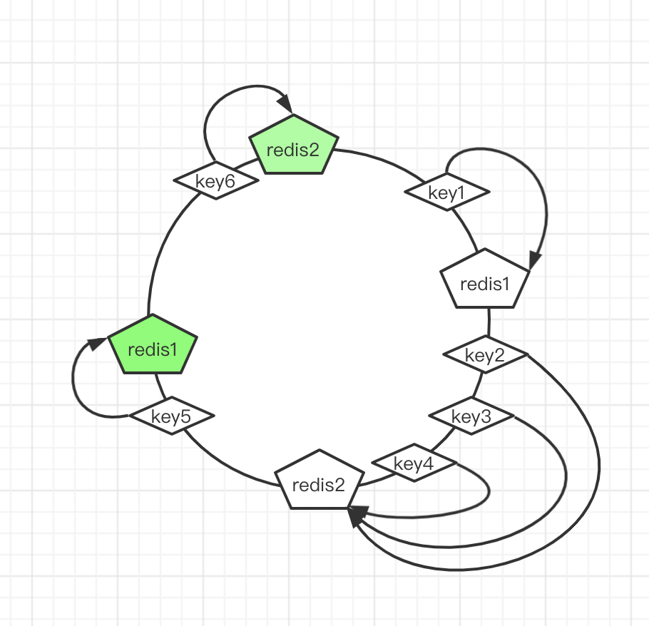

# 缓存穿透

当缓存中查不到数据时，会越过缓存层直接查询数据库称为缓存穿透

缓存穿透无法避免，需要避免的是高频的缓存穿透。

比如黑客使用不存在的值高频访问缓存接口，缓存中查询不到数据则会直接查询数据库

### 方案1 - 返回null值

如果查询的key不存在，数据库中也查询不到记录，则在缓存中创建一个value为null的键值对

#### 问题

如果有恶意的请求使用大量不存在的uuid来查询，依然每次都会查询数据库。

同时也会将redis填满value为null的键值对，当redis内存不足时，就会启动内存淘汰机制，将正常的缓存数据失效。

### 方案2 - 使用过滤器

对查询用的key进行过滤，判断key是否合法，不合法不查询数据库也不直接返回。

过滤的条件可以是**从数据库中拉取所有的key**

#### 问题

- 可能会有数据不同步的情况导致查询不到数据
- 维护过滤器中的key需要额外的开发成本
- 如果数据库表的数据量大，过滤器也会**占用大量的内存空间**

### 方案3 - 布隆过滤器

将原本过滤器中维护的一个key的集合改为**字节数组**，通过**hash函数**将key**映射到字节数组的一个index**

根据数据库中key的规模来确定字节数组的长度（index对应的byte值：0表示这个key不存在，1表示存在）

#### 降低hash碰撞概率

1. 加大字节数组的长度（显而易见）

   hash碰撞的概率是字节数组长度的倒数

   长度为100亿的字节数组，占用1G内存

2. 增加hash函数的个数

   一个hash函数发生碰撞的概率是`1/字节数组长度`，对一个key使用多个hash函数，来减少hash碰撞的几率

图示描述了额外增加hash函数的作用

数据库中存在key1和key2，传入一个client key进行过滤，验证数据库中是否存在client key

如果只使用`hash函数2`

- `hash2(key1) = 4`
- `hash2(key2) = 13`
- `hash2(client key) = 4`

client key与key1发生了hash碰撞，如果只使用`hash函数2`的过滤器就会判断client key在数据库中，会放行，使用client key查询数据库

使用`hash函数1`和`hash函数2`

- `hash1(key1) = 2` & `hash2(key1) = 4`
- `hash1(key2) = 11` & `hash2(key2) = 13`
- `hash1(client key) = 0` & `hash2(client key) = 4`

虽然hash函数2中，client key与key1发生了hash碰撞，但使用hash函数1不会与key1发生hash碰撞。说明并不是client key与key1不是相同的值，过滤器会拦截。

#### 注意点

1. 布隆过滤器不能完全的过滤掉非数据库的key 通过容忍一定的错误率（**hash碰撞**）换取减少内存空间占用

2. 字节数组的长度和hash函数的个数需要根据数据库中的key规模调整

   字节数组过短或者hash函数个数过多都会导致严重的hash碰撞（数组的大部分元素都是`1`）而失去过滤作用

3. 存放byte数组的地方可以是在JVM内存中也可以使用Redis的byteMap

# 缓存击穿

因为一个key过期导致大量对于这个key的查询请求达到mysql

一般场景中，对一个key的并发不足以威胁到mysql。只有在大公司的高并发场景的热门数据才有可能出现这个问题

### 解决方案

#### 分布式锁

缓存中查询不到，在查数据库之前，先获取分布式锁。如果获取锁则查询数据库，**并将查询结果写回到缓存中**，然后释放锁；如果获取不到锁，则自旋等待一会，再查询缓存（此时其他的线程或进程已经把数据更新到缓存中）获取数据

> 分布式锁其实没有必要，关键是查询mysql之后将数据写回到缓存中
>
> 可以去掉分布式锁
>
> 如果读不到缓存数据进行一个**时长随机的自旋等待**。先结束的查一遍缓存发现还是没有，则查数据库，并将查询结果数据写回到缓存；后结束的再查缓存就能直接获取到数据

# 缓存雪崩

缓存的数据再某一个时刻同时失效（无法访问），大量的请求打到MySQL，会导致mysql宕机

### 原因&解决方案

1. 缓存中数据的过期时间相同

   解决方案：为每一条数据设置**范围内的随机过期时间**

2. redis服务挂了，无法提供服务

   使用分布式架构的redis（切片或者主从复制）

# 集群

### 一致性hash算法

在hash算法进行负载均衡/请求路由/切片分区时，通过对`key的hash值`与`集群实例数`进行取模，将请求转发到对应的实例上

但是**当集群扩容（新增实例）**后，相同的key使用hash取模可能就无法路由到新增实例之前的实例（对于**分片存储**的分布式应用如redis和mongodb，需要进行数据迁移，普通hash算法会导致从多个实例中迁移数据）

于是引入了一致性hash算法，保证数据迁移时，**从单一的实例迁移数据到新增实例**

> 一致性指的是数据迁移时的一致性
>
> - 定位实例：只会是一对一 不会出现一对多
> - 定位数据：

#### hash环

假设一个环上顺序分布着`2^32`个点，序号是`0 ~ 2^32 - 1`（标号`2^32 - 1`后面回到0）

让实例和key都映射hash环

唯一标识的hashCode与`2^32`取模，然后映射到hash环上对应的点

key在hash环上顺时针找到最近的实例，作为一致hash的结果，将数据存到对应的redis实例

### 数据迁移

新增一台redis实例，如图所示key5的数据会从redis1改为存到redis3中

数据迁移时只需要将hash环上下一个节点（redis1）中（位于redis2和redis3之间）的数据迁移到redis3中

### 数据倾斜

如果分布hash环上的数据节点分布比较集中（如图一中 顺时针redis1到redis2的区间小于redis2到redis1的区间），在分布数据时大多数的数据都会被hash到redis1上

#### 虚拟节点

使用新增虚拟节点的方式来平衡

