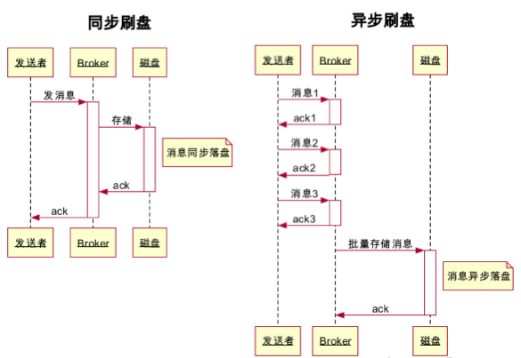

# RocketMQ数据模型

RocketMQ的消息数据存储在topic逻辑分区，一个topic可以包含多个MessageQueue，这些MessageQueue可以分布在多个broker节点上，多个broker为一个topic提供消息服务，分担网络负载和磁盘存储

## Topic

作为消息的逻辑分区，用来隔离不同的数据域

## MessageQueue

作为消息的逻辑存储单元，一个Topic下默认4个messageQueue

# 存储原理

broker接收到消息后，会将消息存到对应的MessageQueue中

MessageQueue作为消息数据的逻辑单元，分布在topic对应集群的不同broker节点上

在broker中MessageQueue是通过CommitLog和ComsumeQueue共同实现

## 存储策略（提高IO效率）

### 顺序写

消息数据CommitLog和ConsumeQueue的持久化都是通过按时间顺序追加写入文件，提高数据写盘的性能

> 磁盘的速度完全可以匹配上网络的数据传输速度，目前的高性能磁盘，顺序写速度可以达到600MB/s，超过了一般网卡的传输速度。
>
> 而磁盘的随机写的速度只有100KB/s，和顺序写的性能差了好几个数量级。

### 元数据和payload分离

CommitLog只存储消息体，纯payload二进制数据，消息的其他元数据以索引的方式保存在ConsumeQueue文件中 

### 异步刷盘 - pageCache

基于操作系统的PageCache和顺序写的两种机制，来提升CommitLog文件的性能

写入CommitLog文件的时候，不是直接写入底层的物理磁盘文件的，而是先进入**OS的PageCache内存缓存**中，然后后续由OS的后台线程选一个时间，异步化的将OS PageCache内存缓冲中的数据刷入底层的磁盘文件，这就是所谓的**异步刷盘**

#### 同步刷盘 - 保证数据安全

调用操作系统的写入命令时，当数据写入物理磁盘后才会返回ACK（表示数据写入成功）

- 优点：数据不丢失
- 缺点：降低吞吐量作为代价

#### 异步刷盘 - 提高写盘效率

异步刷盘模式下，当数据写入到PageCache，操作系统就会返回ACK（表示数据写入成功），这样虽然能提高写入的效率，提高吞吐量

但同时也会存在丢失数据的问题：当数据写入到PageCache当没有来得及写入到磁盘时，这部分内存中的数据就会丢失

## 存储数据结构

### CommitLog 存储payload

broker接收到消息后，会**顺序**的将消息体（payload）以二进制的形式写入到CommitLog目录下的CommitLog文件

每一个文件大小限制为1GB

#### 目录位置

通过broker启动配置文件的`storePathCommitLog`属性设置CommitLog目录位置

例如：`storePathCommitLog=/tmp/rmqstore/node00/commitlog`

### ConsumeQueue 存储元数据

> 类似**索引**的概念，ConsumeQueue文件里存储的每一条消息对应在CommitLog文件中的消息数据的读取信息
>
> commitLog只单纯的负责存储数据（没有额外的数据结构来表示message属于哪个topic的哪个MessageQueue）。需要通过ConsumeQueue文件来区分这些数据对应的是broker下的MessageQueue

**写入**时，broker的接收到的所有消息顺序存储到commitLog中，同时会根据消息的topic和MessageQueue，将commitLog中的消息的存储信息【**物理存储地址（offset）**、存储的数据**长度**、消息的**tag** 没一条数据长度为20B】写到对应的ConsumeQueue文件中

**查询**时，MessageQueue通过topic、queueId找到ConsumeQueue文件，读取索引找到commitLog中的消息数据

> 存储文件：`$HOME/store/consumequeue/{topic}/{queueId}/{fileName}`
>
> 例如一个名为order的topic，在当前broker下有个两个MessageQueue，则对应的ConsumeQueue文件为
>
> - `$HOME/store/consumequeue/order`
>   - MessageQueueID0
>     - ConsumeQueue0
>     - ConsumeQueue1
>     - ···
>   - MessageQueueID1
>     - ConsumeQueue0
>     - ConsumeQueue1
>     - ···

## 主从集群

一组broker组成的高可用的主从集群中，其中一个master角色和多个slave角色：

master接收producer客户端的写请求后，将数据同步给其他的slave节点

### 主从复制模式

同步复制和异步复制是通过Broker配置文件里的brokerRole参数进行设置的，这个参数可以被设置成ASYNC_MASTER、SYNC_MASTER、SLAVE三个值中的一个

#### 同步复制 - 强一致 CP

master接收到消息后，等到master和slave均写成功，才会返回客户端消息发送成功

#### 异步复制 - 最终一致 AP

master接收到消息后，只要master写成功了，就会返回客户端消息发送成功，同步到slave节点的动作异步进行

### DLedger 主从选举

> 当master节点宕机后，rocketmq没有自带的主从切换实现，而是需要**手动**修改一个slave节点的配置然后重启，将slave切换成master
>
> 引入DLedger插件可以实现leader宕机后，follow节点选举出新的leader，并自动切换

开启DLedger插件，会**替代broker来管理CommitLog**

#### 开启DLedger功能

##### 安装DLedger组件

DLedger是一个**独立的进程**，在每一个broker节点上安装一个DLedger服务，DLedger服务会监听一个端口，用于集群中DLedger服务之间的通信

##### broker配置开启DLedger模式

#### Raft协议-选举

- 设定每个节点默认投票给自己
- 如果一轮选举结果 都是选自己，所有节点休眠随机一段时间
- 先唤醒的节点投自己并广播到其他节点
- 后唤醒的节点收到之前唤醒节点的投票后，会投票给先唤醒的节点
- 最终会选举出最先被唤醒的节点 作为master

### Raft协议-多副本同步

数据同步会分为两个阶段：uncommitted阶段和committed阶段

#### uncommitted状态

Leader节点上的DLedger收到一条数据后，会标记为uncommitted状态，通过自己的DLedgerServer组件把这个uncommitted数据发送给Follower Broker的DLedgerServer。

#### committed状态

Follower Broker的DLedgerServer收到uncommitted消息之后，必须返回一个ack给Leader  Broker的DLedgerServer，然后如果Leader Broker收到**超过半数**的Follower  Broker返回ack之后，就会将消息标记为committed状态。

然后Leader Broker上的DLedgerServer就会发送commited消息给Follower Broker机器的DLedgerServer，让他们也把消息标记为comitted状态。

## 消息数据清理

RocketMQ会将消息持久化到磁盘。但是不会像mysql一样，永久将数据保存在磁盘上，因为消息队列中间件设计的目的是数据中转而不是数据存储

### 定时任务清理

#### 删除触发条件

rocketMQ内部的消息清理机制，每10s执行一次CleanCommitLogService

不是每10s删除一次，而是没10s**检查是否满足开启清理任务**的条件

- timeup：到每天指定的时间点 默认设置是每天凌晨4点

  `private String deleteWhen = "04";`

- spacefull：磁盘满

  - `diskMaxUsedSpaceRatio`：磁盘最大利用率 默认是`75`，超过则触发消息清理
  - `DiskSpaceCleanForciblyRatio`：磁盘空间**强制删除**文件水位。默认是`85`
  - `DiskSpaceWarningLevelRatio`：磁盘空间警戒水位 默认是`90`，超过则**停止接收新消息**

- manualDelete：手动触发删除

#### 清理策略

##### 文件删除顺序

commitLog是顺序写盘的，删除文件时也是用序号较小的commitLog文件开始删除

##### 文件过期删除

满足删除触发条件后，会删除过期的文件（**删除的单位是文件而不是消息**）

消息过期配置文件的过期时间 `fileReservedTime`：文件过期时间，也就是从文件最后一次的更新时间到现在为止，如果超过该时间，则是过期文件可被删除

由于commitLog是顺序写入且不会修改已经写入的消息。清理文件时，只需要循序

##### 限量删除

每次触发删除操作最多运行删除10个commitLog文件，因为删除操作会占用IO资源，降低插入消息的性能

通过设置`deletePhysicFilesInterval` 删除物理文件的时间间隔

##### 强制删除

当磁盘使用率大于85%（超过磁盘空间强制删除文件水位 `DiskSpaceCleanForciblyRatio`）

由于前面的删除顺序和限量删除，强制删除一次最多只会删除10个生成时间最早的commitLog

> 参考
>
> https://blog.csdn.net/Memery_last/article/details/83791165
>
> https://www.jianshu.com/p/2ce8aa1bd438
>
> https://www.jianshu.com/p/96a011a30d6a